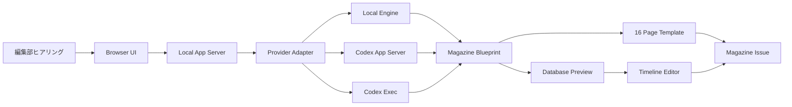

# アーキテクチャ設計

## 全体像

## レイヤー

### 1. UI レイヤー

- `index.html`
- `src/styles.css`

ヒアリングフォーム、生成結果、DBプレビュー、16ページ構成を表示する。

### 2. アプリケーションレイヤー

- `src/app.js`
- `server.js`
- `codex-app-server-client.js`

フォーム入力を読み取り、HTTP API経由で世界線生成、画像プロンプト生成、ページ構成生成を行う。

`codex-app-server-client.js` は `codex app-server` を子プロセスとして起動し、JSONL over stdio で以下の最小フローを実行する。

- `initialize`
- `initialized`
- `thread/start`
- `turn/start`
- `item/agentMessage/delta`
- `item/completed`
- `turn/completed`

### 3. データレイヤー

- `data/seed-worldline.json`

初期の架空ハード、メーカー、ライター、記事タイプ、広告文化を定義する。

## 拡張方針

- `WorldlineEngine` を将来 API 化する。
- `seed-worldline.json` を号数ごとの状態保存DBへ拡張する。
- LLM 連携時は「世界線DB + 号数状態 + 記事タイプ + ライター人格」をプロンプトに渡す。
- 画像生成時はページ種別ごとにスタイルプロンプトを固定する。
- 実画像生成は次段階で追加し、現段階では画像生成プロンプトまでを App Server で作る。

## 状態管理

初期版ではブラウザメモリのみを使用する。将来的には以下に分離する。

- `worldline`: 永続するIF歴史設定
- `issue`: 各号の生成状態
- `persona`: ライター人格
- `readerCommunity`: 読者投稿・ランキング傾向

## 雑誌生成

`issueDate`、現在の世界線、編集済み年表を入力として、16ページの雑誌JSONを生成する。生成結果は `data/magazines/YYYY-MM.json` に保存する。

年表は雑誌生成時に `timelineDigest` と各ページの `timelineRefs` に反映される。これにより、年表を編集すると次回生成される誌面の見出し、本文、特集テーマが変化する。
